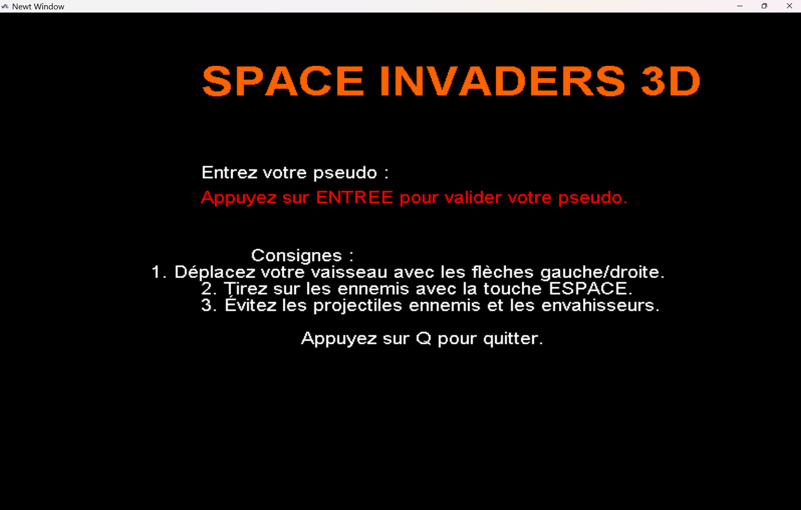
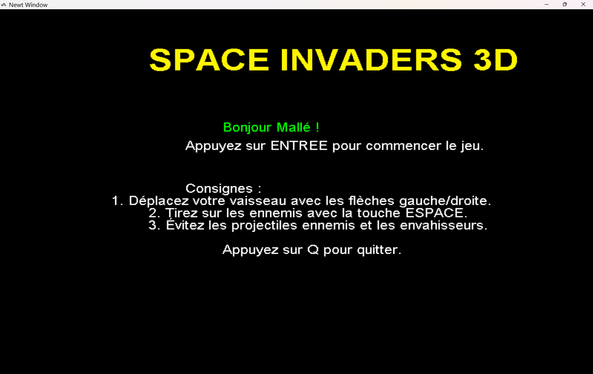
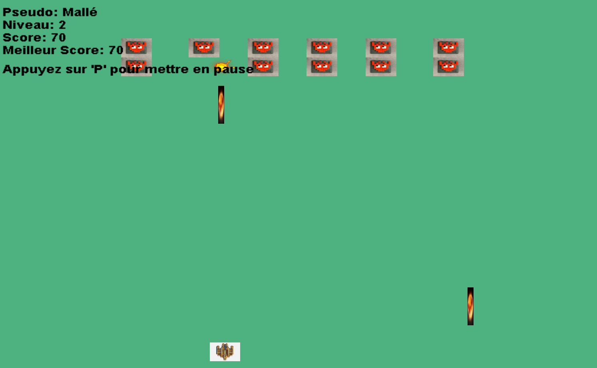
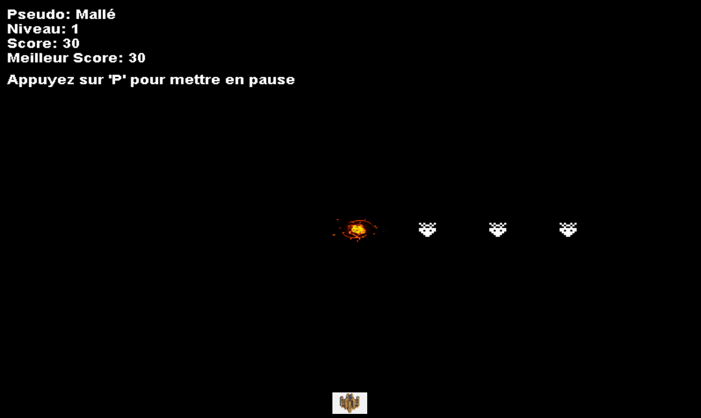

# Space Invaders 3D  Licence pro projet web et Mobile


Space Invaders 3D est un jeu d'arcade moderne inspiré du classique Space Invaders. Le jeu propose des vagues d'ennemis variés, des effets visuels étonnants, et des explosions réalistes pour une expérience immersive.

---

## ✨ Fonctionnalités principales

- **Graphismes 3D sur un plan fixe** pour une expérience immersive.
- **Vagues progressives** d'ennemis avec des difficultés croissantes.
- **Types d'ennemis variés** :
  - **FastEnemy** : Rapides mais fragiles.
  - **TankEnemy** : Lents mais résistants.
  - **ShootingEnemy** : Capables de tirer des projectiles vers le joueur.
- **Effets visuels** : Explosions réalistes avec animations fluides.
- **Effets sonores** :
  - Tirs du joueur.
  - Explosions immersives.
- **Menus intuitifs** :
  - Menu principal.
  - Menu pause.
  - Menu de fin de partie.
- **Gestion des scores** avec un affichage des meilleurs scores.

---

## 🚀 Installation et exécution

### Prérequis

- **Java Development Kit (JDK)** : version 8 ou supérieure.
- **Bibliothèque JOGL** pour le rendu graphique OpenGL.

### Installation

1. **Cloner le dépôt :**
   ```bash
   git clone https://github.com/moncompte/space-invaders-3d.git
   cd space-invaders-3d
   ```

2. **Configurer les dépendances :**
   - Assurez-vous que la bibliothèque JOGL est correctement installée. 
     Téléchargez les fichiers nécessaires depuis [https://jogamp.org/deployment/jogamp-current/archive/](https://jogamp.org/deployment/jogamp-current/archive/).
   - Placez les fichiers JAR de JOGL dans un dossier `lib/` à la racine du projet.

3. **Compiler et exécuter :**
   ```bash
   javac -cp lib/* -d bin src/**/*.java
   java -cp bin:lib/* spaceinvader3d.Game
   ```

---

## ⚡ Commandes

- **Déplacement :**
  - Flèche gauche / droite : Déplacer le vaisseau.
- **Tirer :**
  - Barre d'espace.
- **Pause :**
  - Touche 'p'.
- **Rejouer :**
  - Appuyez sur `1` dans le menu Game Over.
- **Quitter :**
  - Appuyez sur `2` dans le menu Game Over.

---

## 🎮 Captures d'écran

### Menu principal





### En action



### Explosions




---

## © Crédits

- **Code :** [Mallé TRAORE].
---
